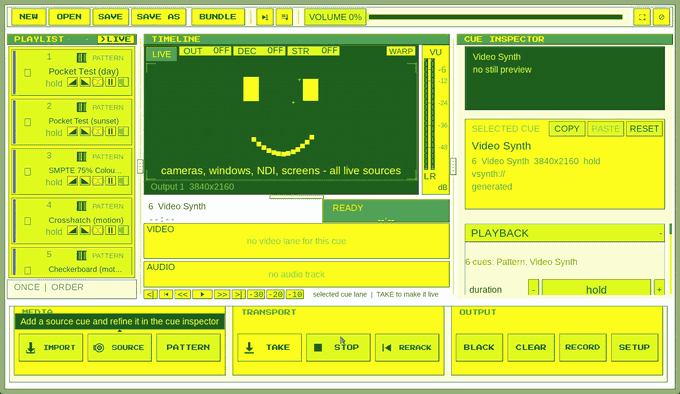
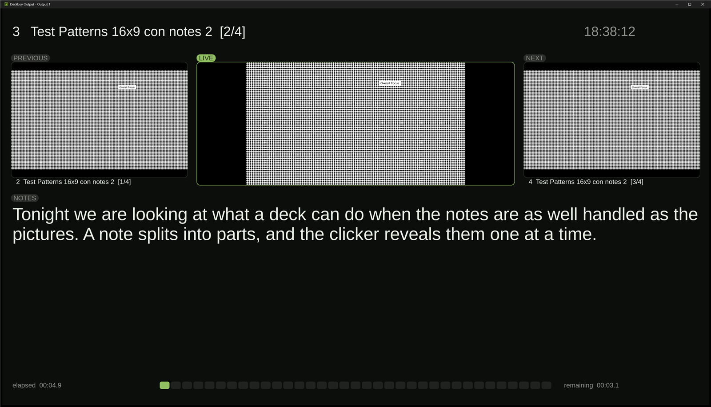
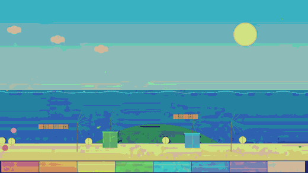

# Deckboy 🎬

[](https://github.com/Utopian-Academy/Deckboy/releases)
[](LICENSE)
[](#)
[](#)
[](https://github.com/Utopian-Academy/Deckboy/stargazers)
[](https://github.com/florisporro/awesome-ndi)

**Free, open-source cue-based media playback and show control for live video —
theatre, live events, worship and broadcast.**

If Deckboy runs part of your show, a ⭐ on this page is how the next operator
finds it.

### Everything is a cue

A clip. A still. A slide. A live camera. A window on the machine. A web page.
An NDI source, an SRT feed, an SDI input. A test card, a countdown, a lower
third, an audio file, a line-up tone. A line of code you type while it is on
the screen. In Deckboy every one of those is the same kind of object, sitting
on the same cue list, and it behaves the same way: same transport, same fades,
same thirteen transitions, same effect rack, same remote control, recorded the
same way on the way out.

So a show can run

```
VIDEO → SLIDE → LIVE CAMERA → WEB PAGE → SRT FEED → TEST CARD → VIDEO
```

with one operator, one spacebar and no alt-tab, because none of those is a
special case. The usual way to do that is a media player, a slide program, a
browser, a capture utility, a streaming tool and a pattern generator, each with
its own idea of what happens when you press play — and a projector that shows
the seams between them.

The other half of the same idea: every **destination** is the same kind of
object too. A screen, NDI, SRT, RTMP, Blackmagic SDI, SMPTE ST 2110 — several
at once, while it records, each with its own warp, feather and area of
interest. Driven from a Stream Deck, Bitfocus Companion, OSC, MIDI, MIDI Show Control
from the lighting desk, Art-Net or LTC timecode.

Anything that can make a picture or a sound becomes a cue. Anything that needs
to receive the show becomes an output.

It hosts **your own VST3 effects and instruments** in a cue's audio chain, and runs on a
machine with **no sound card at all** — a rack PC feeding a video wall still
opens, plays and puts a picture out.

Windows, macOS and Linux from one show file. No account, no licence server, no
telemetry, and no second licence for the spare machine in the flight case —
which is not true of anything it gets compared to.

**[deckboy website](https://utopian-academy.github.io/Deckboy/)** — what it does, and where to download it. · **[How it compares](https://utopian-academy.github.io/Deckboy/compare.html)** to Mitti, PlaybackPro, QLab, Millumin and vMix. · **[Manual](https://utopian-academy.github.io/Deckboy/manual.html)** — all of it, twenty-six chapters. · **[FAQ](https://utopian-academy.github.io/Deckboy/faq.html)** · **[Where latency hides](https://utopian-academy.github.io/Deckboy/latency.html)** — the four stages of a live chain, in frames and milliseconds

<!-- GENERATED CONTENT ONLY in this shot -- the built-in pattern generators,
     never a real show file. A client's deck in a public README is a client's
     deck on the internet. -->



<sub>Shown with the test patterns Deckboy generates itself, so nothing here is anyone’s show file.</sub>

---

## Download

Every release ships an installer **and** a portable build for each platform.
Both bundle everything they need — binary, ffmpeg, runtime libraries. Nothing
else to install.

| Platform | Installer | Portable |
|---|---|---|
| **Windows** | `…-windows-x64-setup.exe` — Start Menu, uninstaller, `.deckboy` file association | `…-windows-x64.zip` |
| **macOS** (Apple Silicon) | `…-macos-arm64.dmg` — drag to Applications | `…-macos-arm64.zip` |
| **macOS** (Intel) | `…-macos-x86_64.dmg` | `…-macos-x86_64.zip` |
| **Linux** | `…-x86_64.AppImage` — one file, `chmod +x` and run | `…-linux-x86_64.tar.gz` |

Both control surfaces ship with every release, so neither needs a build:
**Stream Deck** (`…streamDeckPlugin` — double-click it) and **Bitfocus
Companion** (`Deckboy-companion-module-….zip` — unzip it, then point
Companion's *developer modules path* at the folder containing it;
`INSTALL.txt` inside has the three steps). The Companion module requires
**Companion 5**.

→ **[Latest release](https://github.com/Utopian-Academy/Deckboy/releases/latest)**

<details>
<summary><b>"Unknown developer" warnings — what to do</b></summary>

Deckboy is not code-signed. Signing is a paid developer account with Apple and
with Microsoft, and the project has not bought one -- so the builds are fine and
the OS simply does not recognise the publisher. It is on the roadmap below for
the macOS releases, where the warning is most in the way.

- **macOS** — if it says the app is damaged, clear the quarantine flag once:

      xattr -dr com.apple.quarantine /Applications/Deckboy.app

  Install from the `.dmg` into Applications rather than running from Downloads;
  that is also what avoids Gatekeeper's App Translocation sandbox.
- **Windows** — SmartScreen may say "Windows protected your PC". Click
  **More info → Run anyway**.
- **Linux** — the AppImage runs on **Ubuntu 22.04 and anything newer**, which
  is what a lot of venue machines are still on. Graphics, display server, audio
  and the C/C++ runtime deliberately come from the host: they have to match the
  machine actually running, and a bundled libGL cannot load your GPU driver.
  The build checks that floor on every run rather than trusting it.

</details>

---

## What it is

Deckboy is a native desktop application for video engineers, AV technicians and
live operators who need a reliable way to organise media, trigger cues, loop
content and send video to production displays.

That is the job it is built around, and it is built on a stubborn principle:
**Seize the means of playback ♡**

No subscription ♡ No account ♡ No telemetry ♡ Nothing phones home. And no licence
server that can refuse to start the show at 19:55 because it could not reach the
internet. The machine you carried into the venue is the machine that plays the
show.

### What can be a cue

| | |
|---|---|
| **Video** &middot; **Image** &middot; **Audio** | files, hardware-decoded, trimmed and faded |
| **Slides** | a PDF, PowerPoint or Keynote deck, one cue per slide, with the notes |
| **Browser** | a URL rendered into the programme, not a browser window on your desktop |
| **Window** &middot; **Screen** &middot; **Camera** | captured live, at the window's own full resolution |
| **NDI** &middot; **SRT / RTMP / RTSP / UDP** &middot; **DeckLink** &middot; **Spout** | somebody else's signal, taken in as a cue |
| **Pattern** &middot; **Test card** &middot; **Tone** | generated on the spot, no file needed |
| **Timer** &middot; **Lower third** | a stage countdown and a name strap, as cues |
| **PiP** &middot; **Composite** | one cue built out of other cues — quad split, side by side |
| **Video synth** &middot; **Code** | an oscillator with feedback, or an expression you type live |

Every row takes the same fades, the same transitions, the same effect rack, the
same trigger from a Stream Deck, and is recorded the same way on the way out.
[Chapter 5 of the manual](https://utopian-academy.github.io/Deckboy/manual.html#cue-types)
is the full table, source by source.

### Which makes it a very good video Swiss army knife

That is not a second feature list. It is what falls out of the first one. If a
camera is a cue and SDI is an output, the machine is a converter. If a stream
is a cue and NDI is an output, it is a bridge. If a test card is a cue, it is a
pattern generator that proves the real chain instead of a test box's.

The same box speaks NDI, SDI, SMPTE ST 2110, SRT, RTMP, Spout, LTC timecode,
OSC, Art-Net and NMOS — so the machine you brought for playout usually solves
the other five problems on the day as well.

- **Convert media** that will not play well, in place, without leaving the app
- **Inspect any file** — codec, raster, frame rate, channels, duration — by importing it
- **Generate test patterns** and a test card to prove a chain end to end
- **Capture** a camera, a window or a screen and treat it as a cue
- **Bridge formats** — bring a camera, capture card or stream in and send the
  programme out as SDI, ST 2110 or a stream, and record it
- **Normalize loudness** to EBU R128 when a client sends a clip mastered too quiet
- **Generate LTC timecode** on its own routable output

### Where it gets used

Live events • Corporate presentations • Churches • Schools & universities •
Museums & installations • Digital signage • Projection • LED walls • Streaming

And the jobs in between: bench-testing a screen before anyone arrives, proving a
cable or converter with a real test card, getting a camera or a stream onto
SDI, restreaming to SRT or RTMP, or making a client's unplayable file
playable on site, minutes before doors.

---

## Features

The long version. It is long because the cue list absorbs so much — but it is
all one object with one set of controls, not fifty separate things to learn.

<details>
<summary><b>Playback &amp; cues</b></summary>

- Cue-based video playback with playlist management
- Drag-and-drop media import
- Play, pause, stop, seek and clear
- Looping and hold-last-frame behaviour
- Fade in/out, per cue and per deck
- Cue trimming, and per-cue transition overrides
- Thirteen transitions: cut, crossfade, dip to black or white, four pushes,
  four wipes and an iris — set per deck, overridden per cue, timed in seconds

</details>

<details>
<summary><b>Sources — everything that can be a cue</b></summary>

- Video clips, images and audio files
- **Slide decks** — a PDF, PowerPoint or Keynote deck imports as one image cue
  per page, rendered at import by the platform's own engine, so nothing during
  a show depends on a document renderer
- Browser cues, rendered inside the programme rather than by a browser
  window on your desktop — a scoreboard, a dashboard or a lyric page is a
  cue like any other, with the same fades and effects
- Camera, window and screen capture, on all three platforms. A window cue
  arrives at the window's own full resolution whatever your display scaling
  is set to, scaled to fit the frame, follows the window as it moves and
  resizes, and anything in front of it stays out of shot. It runs at sixty
  frames a second where the window can afford it, and costs about a fifth of
  what it did: on a 960x540 window with a 4K output, processor use across the
  capture and the application fell from roughly 225% of a core to 45%
- Stream cues take `srt://`, `rtmp://`, `rtsp://`, `udp://` and http HLS
- NDI receive in every download, and Blackmagic DeckLink capture through the
  SDK rather than through a pipe
- Spout shared textures from another application on the machine (Windows)
- **IPTV channel lists**: import an `.m3u` and every channel becomes a cue,
  named and grouped from the list
- Test patterns, a built-in test card, and generated line-up tone
- Timer cues — a stage or speaker countdown with its own clock, thresholds and
  chimes — and lower thirds, both cued like anything else
- PiP and composite cues: one cue built out of other cues, 2-up, quad or 70/30
- A **video synth** — oscillators with feedback, a glitch stack, text mode and
  sprite sets — and a **code source**, a live-coded expression evaluated per
  pixel and edited while it runs, with a compile error that never blacks the
  output

</details>

<details>
<summary><b>Outputs — everywhere a cue can go</b></summary>

- Fullscreen output windows, display selection, and the same programme on more
  than one output at once
- Display-native and fixed raster modes
- Area of interest, edge feathering, warp / keystone correction
- Per-output matte and still overlay, composited into the output's own picture
- NDI output, in every download
- DeckLink (SDI) output, wherever the Blackmagic SDK is present
- SRT and RTMP streaming, each output with its own destination, running while
  the programme is recorded
- Recording that keeps its sound, continuous for the whole take

</details>

<details>
<summary><b>Presenting from slides</b></summary>

- Import a PDF, PowerPoint or Keynote deck as one cue per slide, rendered once
  at import by the platform's own engine -- nothing during the show depends on
  a document renderer
- Speaker notes come with the deck, so a team working a master deck elsewhere
  keeps its fonts *and* its notes
- **Presenter view** as an output type, so it takes its own display: the live
  slide, the one before it, the one after it, the notes and the clock. Every
  panel switches off on its own, the colours are yours, and the panels are
  dragged into place rather than chosen from a list of layouts
- The clicker walks long notes a part at a time, at the speaker's pace — and
  Page Down and Page Up just work, because that is what every clicker sends



- **Teleprompter view**, also an output of its own: the script large, scrolling
  through a fixed reading line, mirrored for a beamsplitter, and driven from a
  hand controller over the control protocol

</details>

<details>
<summary><b>Broadcast / IP video</b></summary>

- SMPTE ST 2110-20 uncompressed video output
- SMPTE ST 2110-30 (AES67) audio output
- PTP (IEEE 1588 / SMPTE ST 2059) media clock slaving
- AMWA NMOS IS-04 registration and Node API
- AMWA NMOS IS-05 connection management, so a broadcast controller can
  discover and route Deckboy's senders

A conformant packetiser a broadcast controller can discover and route. See
[docs/ST2110_FEASIBILITY.md](docs/ST2110_FEASIBILITY.md).

</details>

<details>
<summary><b>Audio</b></summary>

- Per-cue gain trim, pan and mono fold-down
- EBU R128 loudness normalization
- Independent audio fades, separate from video fades
- Content-authoritative stereo waveform display
- Audio-only cues, and per-cue mute
- **Your own VST3 effects and instruments, in the cue's chain.** The reverb you
  already own or the channel strip your mix is built around, sitting beside
  Deckboy's own effects in whatever order you put them, with its settings saved
  in the show. Instruments play from a MIDI keyboard, a controller over the
  network, or the computer's own keys
- **A per-cue effect chain** -- high pass, low pass, tilt EQ, compressor, gate,
  delay, reverb, width and binaural placement, in the order you put them in
- **Five effects that use what the deck knows**, which no plugin is ever told:
  the cue's own picture driving a filter, its position on the output becoming
  the sound's position in the room, the end of the cue resolving the tail,
  stutter locked to the video frame, and a held cue keeping its room tone
- **Eight bends**, for when the point is damage rather than polish — bit
  crushing, a CD skipping, corrupted filter coefficients, and *ouroboros*,
  where the finished picture drives the bend that is driving the picture

</details>

<details>
<summary><b>Show control</b></summary>

- Bitfocus Companion integration (module included)
- OSC input and OSC Query
- TCP command control — every verb answers `OK` or `ERR`
- HyperDeck protocol emulation, so a deck controller can drive it
- Tally-driven playback: roll when an ATEM or an NDI receiver puts you on air
- LTC timecode in, and an LTC generator routable to its own device and channel
- MIDI input, Art-Net / DMX, NMC transport sync in and out

</details>

<details>
<summary><b>Effects &amp; mixing</b></summary>

- A per-cue effect stack on every kind of cue, ordered, with copy/paste of a
  whole chain between cues
- Thirty-eight effects, each with named parameters. Timed one at a time at 1080p
  on a laptop processor, the heaviest measured takes three-quarters of a 60fps
  frame — `--effect-bench` prints what each one costs on yours
- Six that exist nowhere else: schlieren gradient imaging, Chladni nodal
  figures, a true wave equation with inertia, crystal grain growth, retinal
  rod/cone persistence, and structure tensor grain flow


- **Two that cross between picture and sound.** *Databend* reads the frame out
  as a signal and plays it through an audio chain — a delay with feedback, a
  filter, a wavefolder — then paints what comes back, which is the look people
  chase by opening a picture in an audio editor, on a live cue and on a knob.
  *Audioprint* goes the other way and draws the audio the deck has just played
  through the picture, a slice of sound per row. Put one of each on the same
  cue and they bend each other
- An LFO on any parameter — six shapes, free running or locked to a tap tempo
- VJ mode: a second deck live, a crossfader with ten blend modes — dissolve,
  add, screen, multiply, lighten, darken, subtract, undercut, infiltrate and
  ember — tap tempo, and takes quantised to the beat

</details>

<details>
<summary><b>Interface</b></summary>

- **Thirty bundled themes**, switchable live and from a controller, including
  high-contrast terminal themes suited to OLED panels
- Timeline with filmstrip thumbnails; resizable program monitor and timeline
- UI scale that follows the desktop's own scaling
- The interface reads in 38 languages, including Cubano, Klingon and a few
  written in cypher
- Missing-media detection with folder relink, so a moved drive does not cost you
  a rebuild

</details>

---

## Built for operators, not data harvesters

Deckboy collects nothing and sends nothing to its developers. **No telemetry,
no usage reporting, no crash upload, no account.** Crash logs are written to a
file next to the app for you to read or forward, and they stay there.

There is an update check, and it is **off by default**. Switched on, it asks
GitHub's releases API whether a newer version exists — nothing about you goes
with the question, and finding one never installs anything without you saying
so. A machine sitting on a venue's network should do nothing nobody asked it
to.

It is deliberately network-active — NDI discovery, PTP, NMOS registration, OSC,
Companion control and streaming all talk to the network by design. Every one of
those goes to your own LAN or to a destination you configured.

---

## Platforms

One show file opens on Windows, macOS and Linux, and nearly everything above
runs on all three. The exceptions: texture sharing with Resolume, TouchDesigner
or OBS is Spout, on Windows only, and MIDI (including MIDI Show Control) is in
the Windows and Linux downloads but not in the current macOS one.

Hardware decode is used wherever the platform provides it — D3D11VA, Video
Toolbox, VAAPI — and on Windows and macOS the picture never touches system
memory on the way to the screen: roughly ten times less CPU for 4K, which is
CPU your machine gets to spend on everything else.

---

## Documentation

- [Code map](docs/CODEMAP.md) — file inventory, data flow, threading model
- [Packaging guide](docs/PACKAGING.md)
- [Changelog](CHANGES.md)
- [ST 2110 feasibility](docs/ST2110_FEASIBILITY.md)

The changelog is the authoritative record of what landed and, just as
importantly, what each feature deliberately does not do.

---

## Roadmap

- NMOS registry discovery over mDNS, so there is no registry address to type in
- Hardware-paced ST 2110 output for narrow-model compliance
- Syphon *input* on macOS as a cue source (Spout already works both ways on Windows)
- Developer ID signing and notarization for macOS releases

---

## License

Deckboy is free software under the **GNU General Public License v3.0 or later**.
Copyright © 2026 Deckboy Contributors. The full text is in [LICENSE](LICENSE).

Bundled components keep their own licences — ffmpeg ships with its LGPL/GPL
notice beside the binary, and the NDI and DeckLink SDKs are loaded at runtime
rather than distributed.

NDI® is a registered trademark of Vizrt NDI AB.

---

## Contributing

Deckboy is built in the open and contributions are welcome — code, bug reports,
documentation, testing, or production feedback from a real show.

The best open-source tools are built by the communities that use them.

---

## Project status

Actively developed, on all three platforms. Windows, macOS and Linux build from
the same source and every commit is checked by CI in both full and
reduced-feature configurations — macOS as a self-contained app bundle, Linux as
a portable tarball and an AppImage.
